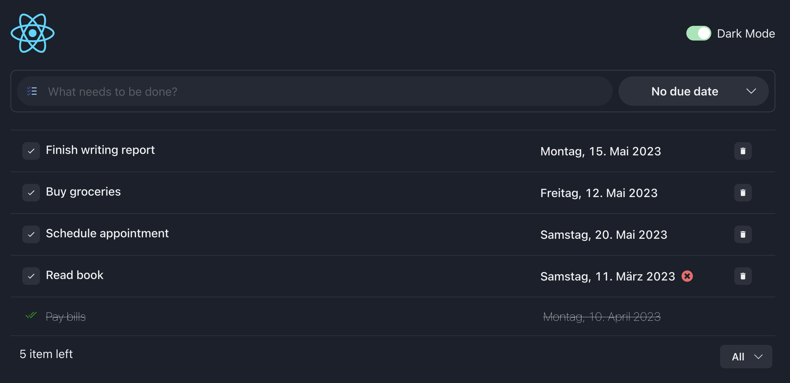
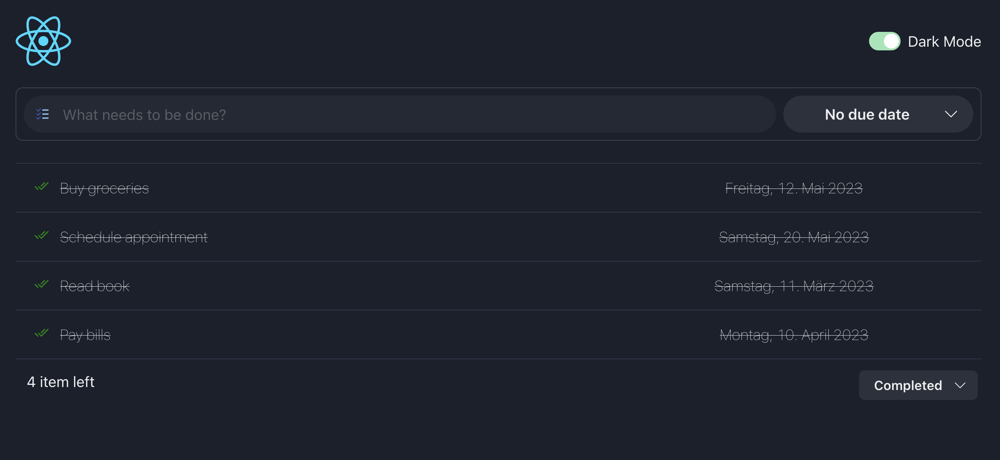
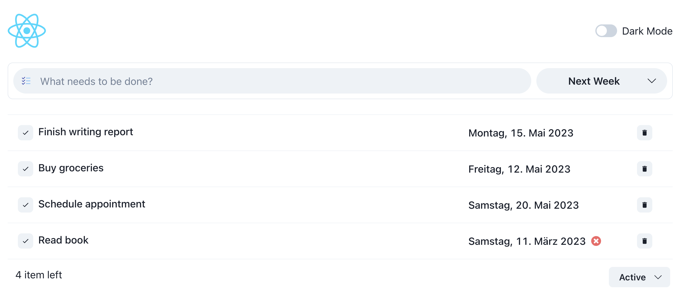

# ToDo App

A ToDo project written using (.NET 7 Web API, Reactjs).








## Getting Started

### Frontend:

#### Prerequisites:

- Node.js v14 or higher
- npm or yarn

#### Installation:

- Clone the repository: git clone https://github.com/tarekselem/todo-ddd.git
- Install dependencies: npm install or yarn install

#### Development

- Start the development server: npm run dev or yarn dev
- Open http://localhost:5173 in your browser to view the app.
  The page will reload if you make edits. You will also see any lint errors in the console.

#### Building for Production

To build the app for production, run:

- npm run build

### Backend:

#### Prerequisites:

Before you start, you will need to have the following installed on your system:

- .NET 7 SDK
- [optional] An IDE like Visual Studio, Visual Studio Code, or JetBrains Rider

#### Installation:

- Clone the repository: git clone https://github.com/tarekselem/todo-ddd.git
- Build the project: dotnet build
- Run the project: dotnet run

#### Usage

Once the project is running, you can access the API at https://localhost:<port>/api/<controller>. Here are some example requests you can make:

**GET /api/todo**
Gets a list of all todos.

**POST /api/todo**
Creates a new todo.

Example request body:

```json
{
  "description": "Finish homework",
  "dueDate": "2023-05-14T23:59:59"
}
```

**GET /api/todo/{id}**
Gets a specific todo by ID.

**PUT /api/todo/{id}**
Updates a specific todo by ID.

Example request body:

```json
{
  "description": "Finish final project",
  "dueDate": "2023-05-21T23:59:59",
  "isCompleted": true
}
```

**DELETE /api/todo/{id}**
Deletes a specific todo by ID.
